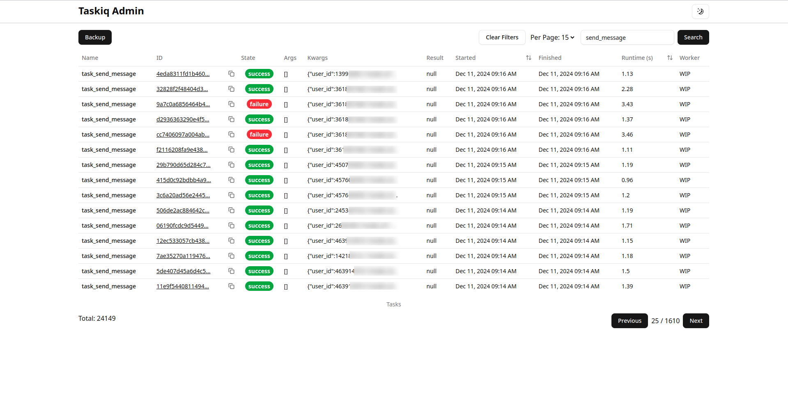
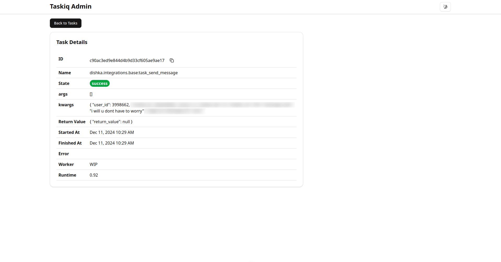

## Broker-agnostic admin pangel for Taskiq

Standalone admin panel with all data stored in SQLite database


- [Broker-agnostic admin pangel for Taskiq](#broker-agnostic-admin-pangel-for-taskiq)
  - [Previews](#previews)
  - [Usage](#usage)
  - [Development](#development)

### Previews
Tasks Page | Task Details Page
:-------------------------:|:-------------------------:
 | 

### Usage

1) Add this middleware to your taskiq broker:

```python
from typing import Any
from datetime import datetime, UTC

import httpx
from taskiq import TaskiqMiddleware, TaskiqResult, TaskiqMessage

TASKIQ_ADMIN_URL = "..." # or your env vars from .env
TASKIQ_ADMIN_API_TOKEN = "..." # or your env vars from .env


class TaskiqAdminMiddleware(TaskiqMiddleware):
    async def pre_execute(self, message: TaskiqMessage):
        """"""

        async with httpx.AsyncClient() as client:
            await client.post(
                headers={"access-token": TASKIQ_ADMIN_API_TOKEN},
                url=f"{TASKIQ_ADMIN_URL}/tasks/{message.task_id}/started",
                json={
                    "worker": "WIP",
                    "args": message.args,
                    "kwargs": message.kwargs,
                    "taskName": message.task_name,
                    "startedAt": datetime.now(UTC)
                    .replace(tzinfo=None)
                    .isoformat(),
                },
            )

        return super().pre_execute(message)

    async def post_execute(
        self,
        message: TaskiqMessage,
        result: TaskiqResult[Any],
    ):
        """"""

        async with httpx.AsyncClient() as client:
            await client.post(
                headers={"access-token": TASKIQ_ADMIN_API_TOKEN},
                url=f"{TASKIQ_ADMIN_URL}/tasks/{message.task_id}/executed",
                json={
                    "error": result.error
                    if result.error is None
                    else repr(result.error),
                    "result": result.return_value,
                    "returnValue": result.return_value,
                    "executionTime": result.execution_time,
                    "finishedAt": datetime.now(UTC)
                    .replace(tzinfo=None)
                    .isoformat(),
                },
            )

        return super().post_execute(message, result)
```

2) Pull the image from DockerHub: `docker pull artur10/taskiq-admin:latest`

3) Replace `ACCESS_TOKEN` with any secret enough string and run:
```bash
docker run -d --rm \
  -p "3000:3000" \
  -v ./taskiq-admin-data/:/usr/database/ \
  -e TASKIQ_ADMIN_API_TOKEN=supersecret \
  --name taskiq-admin \
  artur10/taskiq-admin:latest
```

4) Go to `http://localhost:3000/tasks`

### Development
1) Run `pnpm install` to install all dependencies
2) Run `pnpm db:push` to create the sqlite database if needed
3) Run `pnpm dev` to run the project